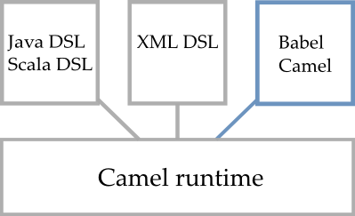
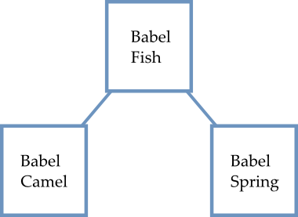

.. _babel-architecture:

Babel Architecture
==================

Babel overview
++++++++++++++

Babel is a Domain Specific Language (DSL). This means Babel helps you to specify what you want to achieve and not to make it directly.

You may see Babel as one more DSL for Apache Camel, among well-known ones such as the Java, Scala and XML DSL:

   Babel Camel is another way to write Apache Camel routes.

Babel Modules
+++++++++++++

Babel is splitted into modules:

* **babel-fish** is the core of Babel
* **babel-camel** is a connector for Apache Camel
* **babel-spring** is an experimental connector for Spring Integration (coming soon)

   Babel's modules : **babel-fish**, **babel-camel** and the experimental **babel-spring**